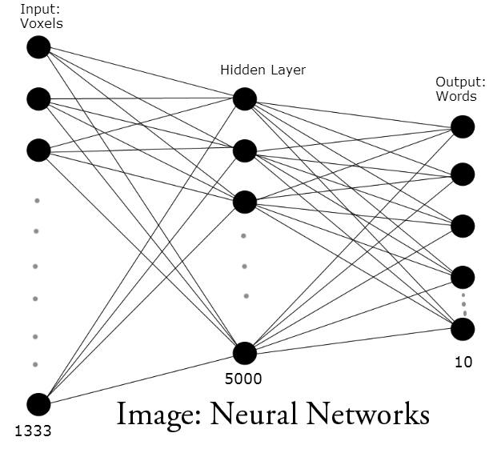

% Project Beta Progress Report
% Yuan Wang (Aria), Cindy Mo, Yucheng Dong (Steve), Rishi Sinha, Raj Agrawal
% December 3, 2015

# Scenes Analysis: Basic Approach
 - Created different factor groups (e.g. Gump house, military, Savanna etc) to test if there was a 
 - connection between these groups and a subject’s brain activity
 - Filtered the data to include only 6800 voxels (with the highest signal)
 - Subsetted the times to only include times that corresponded to a factor id of interest
 - Kmeans clustering

# Scenes Analysis: Some Things We Found:
 - The Gump house and military scenes appeared to have a very strong response in the subject
 - we studied
 - When running kmeans  (with two clusters) on times that corresponded to the factors ‘Gump 
 - house’ and ‘Military,’ we got 88% accuracy 
 - We did this on many other combinations of factor categories. When looking at larger groups, 
 - one thing that stood out was that factor categories that seemed related did relatively poorly in 
 - the clustering. For example, when we tried to cluster the factors ‘military’ and ‘political’ (along
 - with other factors) separately, the clustering labels often mismatched between these two 
 - categories. However, when we re-ran kmeans with these two categories combined, our 
 - overall accuracy went up by 15%. 

# Neural Network: Initialization
- Single layer perceptron
- Input: timepoint with voxel activity as features
- Output: prediction of presence of common words in scene
(e.g. bench, girl)

# Neural Network: Training
- Cross-entropy cost function
- tanh activation function in layer 1, sigmoid activation in layer 2

# Neural Network: Testing
- Correct guess by random chance is $$1/2^10$$
- Able to reach 21.99388%
- 

